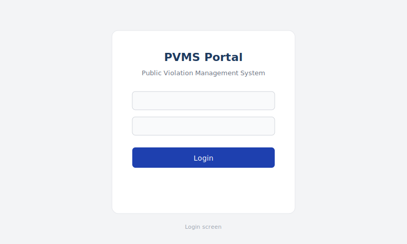

# PVMS — Public Violation Management System

[](https://github.com/Ajinkya1835/omlette/actions/workflows/ci.yml)
[](LICENSE)
[](https://nodejs.org/)
[](https://www.mongodb.com/)

A full-stack **municipal portal** where citizens report property violations, permit holders respond or pay fines, and officers approve accounts and resolve objections — with maps, automated fines, and payments.

**Repository:** [github.com/Ajinkya1835/omlette](https://github.com/Ajinkya1835/omlette)

---

## Live demo

| | URL |
|---|-----|
| **Portal** | _Deploy with [docs/DEPLOY.md](docs/DEPLOY.md) — add your Vercel link here_ |
| **API** | [pvms.onrender.com](https://pvms.onrender.com/health) (if deployed) |

**Try locally in 2 minutes:** `npm run db:up` → `npm run db:import` → `npm run dev:frontend` → [localhost:5173/test-info](http://localhost:5173/test-info)

---

## Screenshots

<table>
  <tr>
    <td align="center"><b>Login</b><br/></td>
    <td align="center"><b>Citizen</b><br/></td>
  </tr>
  <tr>
    <td align="center"><b>Owner</b><br/></td>
    <td align="center"><b>Officer</b><br/></td>
  </tr>
</table>

> Replace SVG previews with real PNGs — see [docs/screenshots/README.md](docs/screenshots/README.md).

---

## Why this project?

- **Multi-role workflows** — not a single-user CRUD app  
- **Real-world domain** — violations, permits, fines, objections  
- **Maps & geodata** — GeoJSON, clustering, radius search  
- **Batteries included** — JSON database files, Docker MongoDB, demo accounts, CI  

---

## Roles

| Role | What they do |
|------|----------------|
| **Citizen** | Report violations with location and photos |
| **Permit holder (owner)** | Manage properties, accept fines, or object |
| **Officer** | Approve registrations, review objections, confirm/waive fines |
| **Admin** | System-level API access (optional) |

---

## Quick start

### Prerequisites

- [Node.js](https://nodejs.org/) 18+
- [Docker](https://www.docker.com/) (optional, for local MongoDB)
- [Google Maps API key](https://developers.google.com/maps) (for maps)

### Install

```bash
git clone https://github.com/Ajinkya1835/omlette.git
cd omlette
npm run install:all
cp backend/.env.example backend/.env
cp frontend/.env.example frontend/.env
```

### Database (included JSON files)

```bash
npm run db:up          # Docker MongoDB → localhost:27017
npm run db:import      # loads database/data/*.json
```

Set `MONGO_URI=mongodb://localhost:27017/pvms` in `backend/.env`.  
Atlas or other hosts: [docs/DATABASE.md](docs/DATABASE.md).

### Run

```bash
npm run dev:backend    # http://localhost:5000
npm run dev:frontend   # http://localhost:5173
```

| Service | URL |
|---------|-----|
| Portal | http://localhost:5173 |
| Test logins (dev) | http://localhost:5173/test-info |
| API health | http://localhost:5000/health |

**Demo password:** `password123` — see [docs/TESTING.md](docs/TESTING.md).

---

## Documentation

| Document | Description |
|----------|-------------|
| [User Manual](docs/USER-MANUAL.md) | Citizens, owners, officers |
| [Features](docs/FEATURES.md) | Feature list and workflows |
| [Setup](docs/SETUP.md) | Installation |
| [Database](docs/DATABASE.md) | MongoDB + bundled JSON data |
| [Deploy](docs/DEPLOY.md) | **Vercel + Render live demo** |
| [Testing](docs/TESTING.md) | Demo accounts & API tests |
| [Architecture](docs/ARCHITECTURE.md) | Tech overview |

---

## Tech stack


React 19 · Vite · Express 5 · MongoDB · JWT · Google Maps · Multer

---

## Scripts

| Command | Description |
|---------|-------------|
| `npm run dev:backend` | API (nodemon) |
| `npm run dev:frontend` | Portal (Vite) |
| `npm run db:up` / `db:down` | Local MongoDB (Docker) |
| `npm run db:import` | Import `database/data/*.json` |
| `npm run seed:demo` | Same demo data via script |
| `npm run test:api` | API smoke tests |
| `npm run build:frontend` | Production build |

---

## Project structure

```
├── backend/           # Express API
├── frontend/          # React portal
├── database/data/     # Demo JSON (users, properties, violations)
├── docs/              # Guides + screenshots
└── .github/workflows/ # CI on every push
```

---

## Deploy & CI

- **CI:** GitHub Actions runs import + API tests + frontend build on every push to `main`.
- **Deploy:** Step-by-step [docs/DEPLOY.md](docs/DEPLOY.md) for Vercel (frontend) + Render (API) + Atlas (DB).

---

## GitHub tips (more visibility)

1. Pin this repo on your profile.  
2. Add topics: `react`, `nodejs`, `mongodb`, `express`, `fullstack`, `google-maps`, `portfolio`.  
3. Set repo **About** description: _Municipal violation management — React, Express, MongoDB_.  
4. Add your live demo URL to the **Live demo** section above after deploy.

---

## License

MIT — see [LICENSE](LICENSE).
